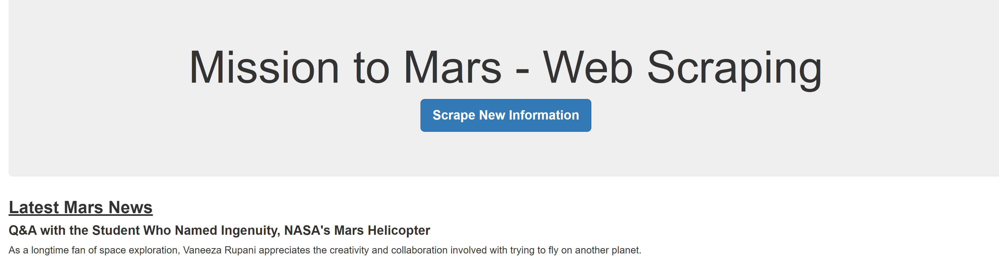
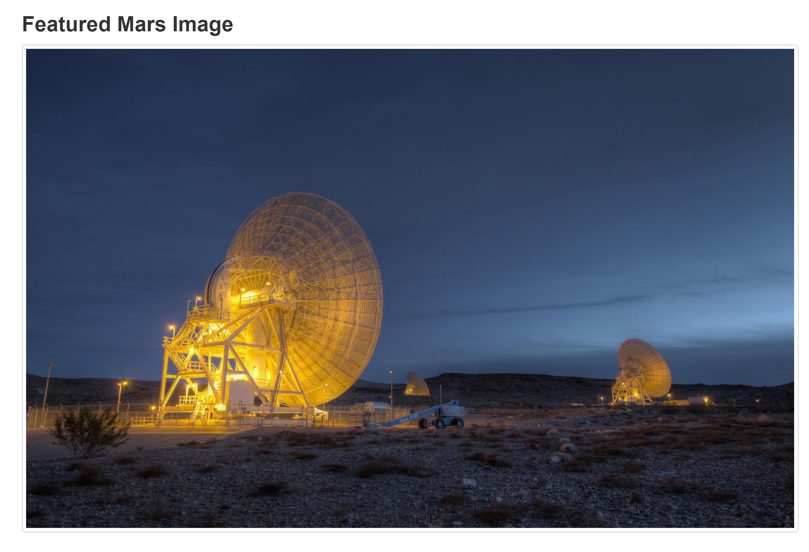
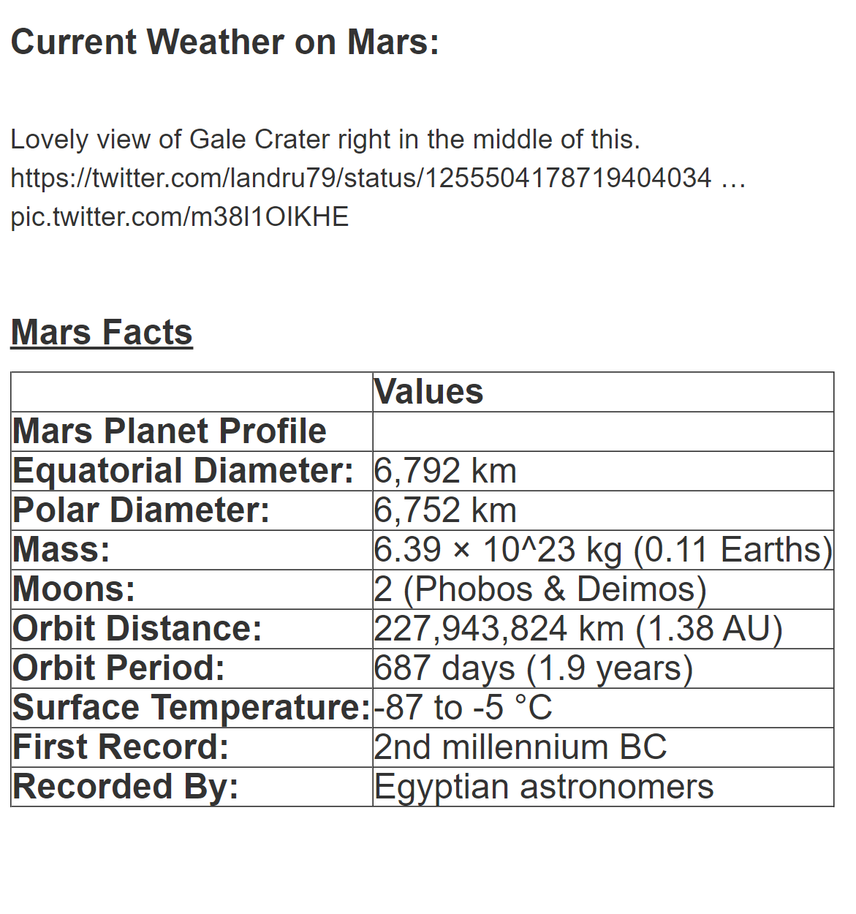

# web-scraping-challenge 
## Web Scraping Homework - Mission to Mars

### The purpose of this assignment was to scrape information from the NASA website. The idea was to gather different pieces of information on our website from News, Images, and Tables from various sources.

### Some of the sources of information used to build this website were the main NASA website, NASA's Twitter, and 3rd party websites like USGS Astrogeology site. 

### The first part of the process of gathering intel was to recollect the latest news from the NASA website. 

### After that, we collected some amazing full-size images from the planet Mars. 

### Also, we gathered from twitter the latest weather report. 

### In the end, we gathered images from Mars Hemisphere. 

